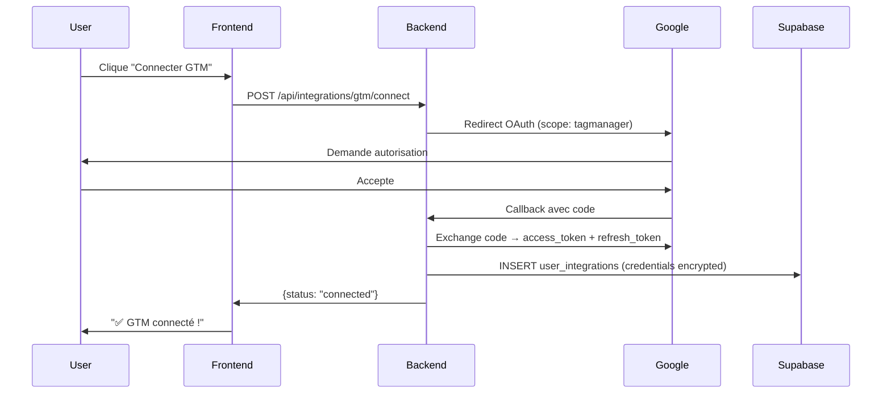

# 🛠️ SPECS TECHNIQUES: MCP SERVERS POUR SORA

## OBJECTIF
Permettre à Sora d'exécuter les tâches de SETUP et d'ANALYSE sans toucher au code source du site utilisateur.

---

## 🔧 1. GTM (Google Tag Manager) MCP Server

### Authentification
- **Méthode:** OAuth 2.0 Google
- **Scopes requis:**
  - `https://www.googleapis.com/auth/tagmanager.edit.containers`
  - `https://www.googleapis.com/auth/tagmanager.readonly`
  - `https://www.googleapis.com/auth/tagmanager.publish`

### Endpoints API
Base URL: `https://tagmanager.googleapis.com/tagmanager/v2`

---

### Fonctions MCP à implémenter

#### 1.1 `gtm_list_containers(account_id)`
**Description:** Liste tous les conteneurs GTM d'un compte.

**Paramètres:**
- `account_id` (string, required): ID du compte GTM (format: "accounts/123456")

**Retour:**
```json
{
  "containers": [
    {
      "container_id": "GTM-XXXXXXX",
      "name": "Site Web Principal",
      "public_id": "GTM-XXXXXXX",
      "usage_context": ["web"],
      "domain_name": ["example.com"]
    }
  ]
}
```

**API Call:**
```
GET /accounts/{account_id}/containers
```

---

#### 1.2 `gtm_list_tags(container_id, workspace_id)`
**Description:** Liste tous les tags dans un conteneur/workspace.

**Paramètres:**
- `container_id` (string, required): ID du conteneur (format: "accounts/123/containers/456")
- `workspace_id` (string, optional): ID du workspace (défaut: workspace par défaut)

**Retour:**
```json
{
  "tags": [
    {
      "tag_id": "123",
      "name": "GA4 Configuration",
      "type": "gaawe",
      "firing_triggers": ["All Pages"],
      "parameters": [
        {"key": "measurementId", "value": "G-XXXXXXXXX"}
      ]
    }
  ]
}
```

**API Call:**
```
GET /accounts/{accountId}/containers/{containerId}/workspaces/{workspaceId}/tags
```

---

#### 1.3 `gtm_create_tag(container_id, tag_config)`
**Description:** Crée un nouveau tag dans GTM.

**Paramètres:**
- `container_id` (string, required): ID du conteneur
- `tag_config` (object, required):
  ```json
  {
    "name": "GA4 Configuration Tag",
    "type": "gaawe", // Types: gaawe (GA4), awct (Google Ads), gclidw (Conversion Linker), html (Custom HTML)
    "parameters": [
      {"key": "measurementId", "type": "template", "value": "G-XXXXXXXXX"}
    ],
    "firing_trigger_ids": ["2147479553"], // All Pages = ID 2147479553
    "tag_firing_option": "oncePerEvent"
  }
  ```

**Retour:**
```json
{
  "success": true,
  "tag_id": "456",
  "tag_name": "GA4 Configuration Tag",
  "message": "Tag créé avec succès"
}
```

**API Call:**
```
POST /accounts/{accountId}/containers/{containerId}/workspaces/{workspaceId}/tags
Body: tag_config
```

---

#### 1.4 `gtm_create_trigger(container_id, trigger_config)`
**Description:** Crée un déclencheur (trigger).

**Paramètres:**
- `container_id` (string, required): ID du conteneur
- `trigger_config` (object, required):
  ```json
  {
    "name": "Click - Email Links",
    "type": "linkClick", // Types: pageview, linkClick, formSubmission, customEvent
    "filters": [
      {
        "type": "contains",
        "parameter": [
          {"key": "arg0", "type": "template", "value": "{{Click URL}}"},
          {"key": "arg1", "type": "template", "value": "mailto:"}
        ]
      }
    ]
  }
  ```

**Retour:**
```json
{
  "success": true,
  "trigger_id": "789",
  "trigger_name": "Click - Email Links"
}
```

**API Call:**
```
POST /accounts/{accountId}/containers/{containerId}/workspaces/{workspaceId}/triggers
Body: trigger_config
```

---

#### 1.5 `gtm_create_variable(container_id, variable_config)`
**Description:** Crée une variable GTM.

**Paramètres:**
- `container_id` (string, required): ID du conteneur
- `variable_config` (object, required):
  ```json
  {
    "name": "DLV - Transaction ID",
    "type": "v", // Data Layer Variable
    "parameters": [
      {"key": "name", "type": "template", "value": "transaction_id"}
    ]
  }
  ```

**Retour:**
```json
{
  "success": true,
  "variable_id": "101",
  "variable_name": "DLV - Transaction ID"
}
```

**API Call:**
```
POST /accounts/{accountId}/containers/{containerId}/workspaces/{workspaceId}/variables
Body: variable_config
```

---

#### 1.6 `gtm_publish_version(container_id, version_name, version_description)`
**Description:** Publie une nouvelle version du conteneur (met en ligne les modifications).

**Paramètres:**
- `container_id` (string, required): ID du conteneur
- `version_name` (string, required): Nom de la version (ex: "v1.2 - GA4 Setup by Sora")
- `version_description` (string, optional): Description des changements

**Retour:**
```json
{
  "success": true,
  "version_id": "15",
  "container_version_id": "accounts/123/containers/456/versions/15",
  "message": "Version publiée avec succès"
}
```

**API Call:**
```
POST /accounts/{accountId}/containers/{containerId}/workspaces/{workspaceId}/create_version
POST /accounts/{accountId}/containers/{containerId}/versions/{versionId}:publish
```

---

#### 1.7 `gtm_preview_mode(container_id)`
**Description:** Active le mode Preview (debug) pour tester les tags.

**Paramètres:**
- `container_id` (string, required): ID du conteneur

**Retour:**
```json
{
  "success": true,
  "preview_url": "https://tagmanager.google.com/#/container/accounts/123/containers/456/workspaces/7/preview",
  "message": "Mode Preview activé. Colle cette URL dans ton navigateur pour tester."
}
```

**Note:** Cette fonction retourne juste l'URL, l'utilisateur doit ouvrir manuellement.

---

### Templates de tags prédéfinis pour Sora

**1. GA4 Configuration Tag**
```json
{
  "name": "GA4 Configuration",
  "type": "gaawe",
  "parameters": [
    {"key": "measurementId", "value": "{{GA4_MEASUREMENT_ID}}"},
    {"key": "sendPageView", "value": "true"}
  ],
  "firing_trigger_ids": ["2147479553"]
}
```

**2. Conversion Linker Tag**
```json
{
  "name": "Conversion Linker",
  "type": "gclidw",
  "parameters": [
    {"key": "enableCrossDomainFeature", "value": "true"},
    {"key": "enableUrlPassthrough", "value": "true"}
  ],
  "firing_trigger_ids": ["2147479553"],
  "tag_firing_option": "oncePerEvent",
  "setup_tags": []
}
```

**3. Google Ads Conversion Tag**
```json
{
  "name": "Google Ads Conversion - Purchase",
  "type": "awct",
  "parameters": [
    {"key": "conversionId", "value": "AW-123456789"},
    {"key": "conversionLabel", "value": "abcDEfGHijKLmnOP"},
    {"key": "transactionId", "value": "{{DLV - Transaction ID}}"},
    {"key": "conversionValue", "value": "{{DLV - Transaction Value}}"},
    {"key": "currencyCode", "value": "EUR"}
  ],
  "firing_trigger_ids": ["{{TRIGGER_ID_PURCHASE}}"]
}
```

**4. GA4 Event Tag (Lead, Click, etc.)**
```json
{
  "name": "GA4 Event - Generate Lead",
  "type": "gaawe",
  "parameters": [
    {"key": "measurementId", "value": "{{GA4_MEASUREMENT_ID}}"},
    {"key": "eventName", "value": "generate_lead"},
    {"key": "eventParameters", "value": [
      {"name": "form_name", "value": "{{Form ID}}"}
    ]}
  ],
  "firing_trigger_ids": ["{{TRIGGER_ID_FORM_SUBMIT}}"]
}
```

---

## 📊 2. Google Ads MCP Server

### Authentification
- **Méthode:** OAuth 2.0 Google Ads API
- **Scopes requis:**
  - `https://www.googleapis.com/auth/adwords`

### Endpoints API
Base URL: `https://googleads.googleapis.com/v16`

**API Version:** Google Ads API v16

---

### Fonctions MCP à implémenter

#### 2.1 `google_ads_get_accounts()`
**Description:** Liste tous les comptes Google Ads accessibles.

**Retour:**
```json
{
  "accounts": [
    {
      "customer_id": "1234567890",
      "descriptive_name": "Mon Compte Google Ads",
      "currency_code": "EUR",
      "time_zone": "Europe/Paris",
      "status": "ENABLED"
    }
  ]
}
```

**API Call:**
```
GET /v16/customers/{customer_id}/googleAdsFields
```

---

#### 2.2 `google_ads_get_campaigns(customer_id, date_range)`
**Description:** Liste toutes les campagnes d'un compte.

**Paramètres:**
- `customer_id` (string, required): ID du compte (format: "1234567890")
- `date_range` (string, optional): "LAST_7_DAYS", "LAST_30_DAYS", "THIS_MONTH" (défaut: "LAST_30_DAYS")

**Retour:**
```json
{
  "campaigns": [
    {
      "campaign_id": "987654321",
      "campaign_name": "Brand Campaign",
      "status": "ENABLED",
      "budget_amount": "50.00",
      "budget_currency": "EUR",
      "impressions": 12500,
      "clicks": 450,
      "conversions": 25,
      "cost": "1250.00",
      "ctr": 3.6,
      "cpc": 2.78,
      "cpa": 50.00,
      "roas": 4.5
    }
  ]
}
```

**API Call (Google Ads Query Language):**
```sql
SELECT
  campaign.id,
  campaign.name,
  campaign.status,
  campaign_budget.amount_micros,
  metrics.impressions,
  metrics.clicks,
  metrics.conversions,
  metrics.cost_micros
FROM campaign
WHERE segments.date DURING LAST_30_DAYS
```

---

#### 2.3 `google_ads_get_search_terms(customer_id, campaign_id, date_range)`
**Description:** Rapport des termes de recherche (Search Terms Report).

**Paramètres:**
- `customer_id` (string, required): ID du compte
- `campaign_id` (string, optional): Filtrer par campagne (si null = toutes)
- `date_range` (string, optional): "LAST_7_DAYS", "LAST_30_DAYS" (défaut: "LAST_7_DAYS")

**Retour:**
```json
{
  "search_terms": [
    {
      "search_term": "chaussures running nike",
      "impressions": 250,
      "clicks": 12,
      "conversions": 2,
      "cost": "25.50",
      "ctr": 4.8,
      "cpa": 12.75,
      "keyword_matched": "chaussures running",
      "match_type": "BROAD"
    },
    {
      "search_term": "chaussures de sécurité",
      "impressions": 100,
      "clicks": 1,
      "conversions": 0,
      "cost": "2.50",
      "ctr": 1.0,
      "cpa": null,
      "keyword_matched": "chaussures",
      "match_type": "BROAD"
    }
  ]
}
```

**API Call (GAQL):**
```sql
SELECT
  search_term_view.search_term,
  metrics.impressions,
  metrics.clicks,
  metrics.conversions,
  metrics.cost_micros,
  search_term_view.ad_group,
  campaign.name
FROM search_term_view
WHERE segments.date DURING LAST_7_DAYS
ORDER BY metrics.impressions DESC
```

---

#### 2.4 `google_ads_get_keywords_quality_score(customer_id, ad_group_id)`
**Description:** Quality Score de chaque mot-clé dans un ad group.

**Paramètres:**
- `customer_id` (string, required): ID du compte
- `ad_group_id` (string, optional): Filtrer par ad group (si null = tous)

**Retour:**
```json
{
  "keywords": [
    {
      "keyword_text": "chaussures running",
      "match_type": "EXACT",
      "quality_score": 8,
      "quality_score_components": {
        "expected_ctr": "ABOVE_AVERAGE",
        "ad_relevance": "ABOVE_AVERAGE",
        "landing_page_experience": "AVERAGE"
      },
      "impressions": 1250,
      "clicks": 45,
      "ctr": 3.6,
      "avg_cpc": 1.25
    }
  ]
}
```

**API Call (GAQL):**
```sql
SELECT
  ad_group_criterion.keyword.text,
  ad_group_criterion.keyword.match_type,
  ad_group_criterion.quality_info.quality_score,
  ad_group_criterion.quality_info.expected_clickthrough_rate,
  ad_group_criterion.quality_info.ad_relevance,
  ad_group_criterion.quality_info.landing_page_experience,
  metrics.impressions,
  metrics.clicks
FROM keyword_view
WHERE segments.date DURING LAST_30_DAYS
```

---

#### 2.5 `google_ads_get_conversions(customer_id)`
**Description:** Liste toutes les conversions configurées.

**Paramètres:**
- `customer_id` (string, required): ID du compte

**Retour:**
```json
{
  "conversions": [
    {
      "conversion_action_id": "123456789",
      "name": "Purchase",
      "type": "WEBPAGE",
      "status": "ENABLED",
      "category": "PURCHASE",
      "conversion_count_30d": 125,
      "conversion_value_30d": "12500.00"
    },
    {
      "conversion_action_id": "987654321",
      "name": "Lead Form Submit",
      "type": "WEBPAGE",
      "status": "ENABLED",
      "category": "LEAD",
      "conversion_count_30d": 45,
      "conversion_value_30d": "2250.00"
    }
  ]
}
```

**API Call (GAQL):**
```sql
SELECT
  conversion_action.id,
  conversion_action.name,
  conversion_action.type,
  conversion_action.status,
  conversion_action.category,
  metrics.conversions,
  metrics.conversions_value
FROM conversion_action
WHERE segments.date DURING LAST_30_DAYS
```

---

#### 2.6 `google_ads_create_audience(customer_id, audience_config)`
**Description:** Crée une audience de remarketing.

**Paramètres:**
- `customer_id` (string, required): ID du compte
- `audience_config` (object, required):
  ```json
  {
    "name": "Visiteurs 30 jours",
    "description": "Tous les visiteurs du site des 30 derniers jours",
    "membership_duration_days": 30,
    "rules": [
      {
        "rule_type": "URL_VISIT",
        "url_contains": "example.com"
      }
    ]
  }
  ```

**Retour:**
```json
{
  "success": true,
  "audience_id": "456789",
  "audience_name": "Visiteurs 30 jours",
  "message": "Audience créée avec succès. Elle sera disponible après accumulation de 1000 utilisateurs."
}
```

**API Call:**
```
POST /v16/customers/{customer_id}/userLists:mutate
Body: audience_config
```

---

#### 2.7 `google_ads_get_performance_report(customer_id, metrics, dimensions, date_range)`
**Description:** Rapport de performances personnalisé.

**Paramètres:**
- `customer_id` (string, required): ID du compte
- `metrics` (array, required): ["impressions", "clicks", "conversions", "cost", "ctr", "cpa", "roas"]
- `dimensions` (array, required): ["campaign", "ad_group", "device", "age", "gender"]
- `date_range` (string, optional): "LAST_7_DAYS", "LAST_30_DAYS", "THIS_MONTH"

**Retour:**
```json
{
  "report": [
    {
      "campaign_name": "Brand Campaign",
      "device": "MOBILE",
      "impressions": 5000,
      "clicks": 200,
      "conversions": 10,
      "cost": "500.00",
      "ctr": 4.0,
      "cpa": 50.00,
      "roas": 4.5
    }
  ]
}
```

**API Call (GAQL):**
```sql
SELECT
  campaign.name,
  segments.device,
  metrics.impressions,
  metrics.clicks,
  metrics.conversions,
  metrics.cost_micros
FROM campaign
WHERE segments.date DURING LAST_30_DAYS
```

---

## 📱 3. Meta Ads MCP Server

### Authentification
- **Méthode:** OAuth 2.0 Facebook
- **Permissions requises:**
  - `ads_read` (lire campagnes)
  - `ads_management` (gérer campagnes - uniquement pour Marcus, pas Sora)
  - `business_management` (accès Business Manager)

### Endpoints API
Base URL: `https://graph.facebook.com/v18.0`

**API Version:** Graph API v18.0

**IMPORTANT:** Sora a accès LECTURE SEULE (ads_read). Marcus a accès ÉCRITURE (ads_management).

---

### Fonctions MCP à implémenter (Sora - LECTURE SEULE)

#### 3.1 `meta_ads_get_ad_accounts()`
**Description:** Liste tous les comptes publicitaires accessibles.

**Retour:**
```json
{
  "ad_accounts": [
    {
      "account_id": "act_123456789",
      "name": "Mon Compte Pub",
      "currency": "EUR",
      "timezone_name": "Europe/Paris",
      "account_status": 1,
      "amount_spent": "5000.00"
    }
  ]
}
```

**API Call:**
```
GET /me/adaccounts?fields=id,name,currency,timezone_name,account_status,amount_spent
```

---

#### 3.2 `meta_ads_get_campaigns(ad_account_id, date_range)`
**Description:** Liste toutes les campagnes d'un compte.

**Paramètres:**
- `ad_account_id` (string, required): ID du compte (format: "act_123456789")
- `date_range` (object, optional): {"since": "2024-01-01", "until": "2024-01-31"} (défaut: 30 derniers jours)

**Retour:**
```json
{
  "campaigns": [
    {
      "campaign_id": "123456789",
      "campaign_name": "Campagne Acquisition Q1",
      "objective": "OUTCOME_SALES",
      "status": "ACTIVE",
      "daily_budget": "100.00",
      "lifetime_budget": null,
      "created_time": "2024-01-01T10:00:00+0000"
    }
  ]
}
```

**API Call:**
```
GET /{ad_account_id}/campaigns?fields=id,name,objective,status,daily_budget,lifetime_budget,created_time
```

---

#### 3.3 `meta_ads_get_insights(object_id, object_type, metrics, date_range, breakdown)`
**Description:** Insights/performances d'une campagne, ad set ou ad.

**Paramètres:**
- `object_id` (string, required): ID de la campagne/ad set/ad
- `object_type` (string, required): "campaign", "adset", "ad"
- `metrics` (array, required): ["impressions", "clicks", "spend", "conversions", "ctr", "cpc", "cpa", "roas"]
- `date_range` (object, required): {"since": "2024-01-01", "until": "2024-01-31"}
- `breakdown` (array, optional): ["age", "gender", "device_platform", "placement"]

**Retour:**
```json
{
  "insights": [
    {
      "date_start": "2024-01-01",
      "date_stop": "2024-01-31",
      "impressions": "50000",
      "clicks": "1500",
      "spend": "2500.00",
      "conversions": "50",
      "actions": [
        {"action_type": "purchase", "value": "50"}
      ],
      "action_values": [
        {"action_type": "purchase", "value": "12500.00"}
      ],
      "ctr": "3.0",
      "cpc": "1.67",
      "cpa": "50.00",
      "roas": "5.0"
    }
  ]
}
```

**API Call:**
```
GET /{object_id}/insights?fields=impressions,clicks,spend,actions,action_values,ctr,cpc,cpa&time_range={date_range}&breakdowns={breakdown}
```

---

#### 3.4 `meta_ads_get_ad_sets(campaign_id, include_insights)`
**Description:** Liste tous les ad sets d'une campagne.

**Paramètres:**
- `campaign_id` (string, required): ID de la campagne
- `include_insights` (boolean, optional): Inclure les métriques de performance (défaut: true)

**Retour:**
```json
{
  "ad_sets": [
    {
      "adset_id": "987654321",
      "adset_name": "Lookalike 1% - FR",
      "status": "ACTIVE",
      "daily_budget": "50.00",
      "bid_strategy": "LOWEST_COST_WITHOUT_CAP",
      "optimization_goal": "OFFSITE_CONVERSIONS",
      "billing_event": "IMPRESSIONS",
      "targeting": {
        "age_min": 25,
        "age_max": 55,
        "genders": [2],
        "geo_locations": {"countries": ["FR"]}
      },
      "insights": {
        "impressions": "10000",
        "clicks": "300",
        "spend": "500.00",
        "roas": "4.5"
      }
    }
  ]
}
```

**API Call:**
```
GET /{campaign_id}/adsets?fields=id,name,status,daily_budget,bid_strategy,optimization_goal,targeting,insights{impressions,clicks,spend,actions}
```

---

#### 3.5 `meta_ads_check_learning_phase(ad_set_id)`
**Description:** Vérifie le statut de Learning Phase d'un ad set.

**Paramètres:**
- `ad_set_id` (string, required): ID de l'ad set

**Retour:**
```json
{
  "adset_id": "987654321",
  "adset_name": "Lookalike 1% - FR",
  "learning_stage_info": {
    "status": "ACTIVE", // ACTIVE (en apprentissage), LEARNING_LIMITED, LEARNING_EXITED
    "conversions_in_learning_phase": 42,
    "conversions_needed_to_exit": 8,
    "days_in_learning": 5,
    "message": "Ad set en phase d'apprentissage. Il a généré 42 conversions sur 50 nécessaires."
  }
}
```

**API Call:**
```
GET /{ad_set_id}?fields=id,name,learning_stage_info
```

---

#### 3.6 `meta_ads_get_pixel_events(pixel_id, date_range)`
**Description:** Liste tous les événements configurés sur un pixel.

**Paramètres:**
- `pixel_id` (string, required): ID du pixel Meta (format: "123456789012345")
- `date_range` (object, optional): {"since": "2024-01-01", "until": "2024-01-31"}

**Retour:**
```json
{
  "pixel_id": "123456789012345",
  "pixel_name": "Pixel Site Principal",
  "events": [
    {
      "event_name": "PageView",
      "event_count_30d": 50000,
      "event_match_quality": 8.5
    },
    {
      "event_name": "Purchase",
      "event_count_30d": 125,
      "event_match_quality": 7.2
    },
    {
      "event_name": "AddToCart",
      "event_count_30d": 450,
      "event_match_quality": 6.8
    }
  ]
}
```

**API Call:**
```
GET /{pixel_id}/stats?fields=event_name,count,event_match_quality&aggregation=event&time_range={date_range}
```

---

#### 3.7 `meta_ads_get_audience_overlap(ad_account_id, audience_ids)`
**Description:** Vérifie le chevauchement entre audiences.

**Paramètres:**
- `ad_account_id` (string, required): ID du compte pub
- `audience_ids` (array, required): IDs des audiences à comparer (max 5)

**Retour:**
```json
{
  "overlap_report": [
    {
      "audience_1": "Visiteurs 30j",
      "audience_2": "Paniers abandonnés",
      "overlap_percentage": 25.5,
      "overlap_count": 1200,
      "message": "25.5% des utilisateurs sont dans les 2 audiences"
    }
  ]
}
```

**API Call:**
```
GET /{ad_account_id}/customaudiences?fields=name,approximate_count&ids={audience_ids}
```

---

## 📊 4. Looker Studio MCP Server

### Authentification
- **Méthode:** OAuth 2.0 Google
- **Scopes requis:**
  - `https://www.googleapis.com/auth/datastudio`
  - `https://www.googleapis.com/auth/analytics.readonly` (pour GA4)
  - `https://www.googleapis.com/auth/webmasters.readonly` (pour GSC)

### Endpoints API
Base URL: `https://datastudio.googleapis.com/v1`

**Note:** L'API Looker Studio est limitée. Certaines actions nécessitent l'utilisation de Google Apps Script ou l'API Embedding.

---

### Fonctions MCP à implémenter

#### 4.1 `looker_create_report(report_name, data_sources)`
**Description:** Crée un nouveau rapport Looker Studio.

**Paramètres:**
- `report_name` (string, required): Nom du rapport (ex: "Dashboard Marketing Q1 2024")
- `data_sources` (array, required): Sources à connecter
  ```json
  [
    {
      "type": "GA4",
      "property_id": "123456789",
      "name": "Google Analytics 4"
    },
    {
      "type": "GOOGLE_ADS",
      "customer_id": "1234567890",
      "name": "Google Ads"
    },
    {
      "type": "SEARCH_CONSOLE",
      "site_url": "https://example.com",
      "name": "Search Console"
    }
  ]
  ```

**Retour:**
```json
{
  "success": true,
  "report_id": "abc123def456",
  "report_url": "https://lookerstudio.google.com/reporting/abc123def456",
  "edit_url": "https://lookerstudio.google.com/reporting/abc123def456/edit",
  "message": "Rapport créé avec succès. 3 sources de données connectées."
}
```

**API Call (Apps Script ou manual):**
```javascript
// Via Google Apps Script
DataStudioApp.createReport()
  .setName(report_name)
  .addDataSource(ga4_source)
  .addDataSource(google_ads_source)
  .build();
```

**Alternative:** Créer via template prédéfini et retourner URL de copie.

---

#### 4.2 `looker_add_scorecard(report_id, config)`
**Description:** Ajoute une scorecard KPI au rapport.

**Paramètres:**
- `report_id` (string, required): ID du rapport
- `config` (object, required):
  ```json
  {
    "metric": "sessions", // ou "revenue", "conversions", "roas"
    "data_source": "GA4",
    "comparison_type": "PREVIOUS_PERIOD", // ou "PREVIOUS_YEAR"
    "position": {"x": 0, "y": 0, "width": 200, "height": 100},
    "style": {
      "backgroundColor": "#FFFFFF",
      "fontColor": "#000000",
      "fontSize": 32
    }
  }
  ```

**Retour:**
```json
{
  "success": true,
  "scorecard_id": "scorecard_1",
  "message": "Scorecard 'Sessions' ajoutée au rapport"
}
```

---

#### 4.3 `looker_add_time_series_chart(report_id, config)`
**Description:** Ajoute un graphique série temporelle (ligne).

**Paramètres:**
- `report_id` (string, required): ID du rapport
- `config` (object, required):
  ```json
  {
    "title": "Revenue par jour",
    "data_source": "GA4",
    "dimension": "date",
    "metrics": ["revenue", "transactions"],
    "date_range": "LAST_30_DAYS",
    "position": {"x": 0, "y": 120, "width": 600, "height": 300}
  }
  ```

**Retour:**
```json
{
  "success": true,
  "chart_id": "chart_1",
  "message": "Graphique 'Revenue par jour' ajouté"
}
```

---

#### 4.4 `looker_add_table(report_id, config)`
**Description:** Ajoute un tableau de données.

**Paramètres:**
- `report_id` (string, required): ID du rapport
- `config` (object, required):
  ```json
  {
    "title": "Top 10 Pages",
    "data_source": "GA4",
    "dimensions": ["pagePath", "pageTitle"],
    "metrics": ["sessions", "bounceRate", "avgSessionDuration"],
    "sort": {"metric": "sessions", "order": "DESC"},
    "row_limit": 10,
    "position": {"x": 0, "y": 450, "width": 800, "height": 400}
  }
  ```

**Retour:**
```json
{
  "success": true,
  "table_id": "table_1",
  "message": "Tableau 'Top 10 Pages' ajouté"
}
```

---

#### 4.5 `looker_blend_data_sources(report_id, blend_config)`
**Description:** Fusionne plusieurs sources de données (blend).

**Paramètres:**
- `report_id` (string, required): ID du rapport
- `blend_config` (object, required):
  ```json
  {
    "name": "GA4 + Google Ads Blend",
    "sources": [
      {"source_id": "ga4_source", "join_key": "date"},
      {"source_id": "google_ads_source", "join_key": "date"}
    ],
    "join_type": "LEFT", // LEFT, INNER, FULL
    "metrics": ["ga4.sessions", "google_ads.clicks", "google_ads.cost", "ga4.revenue"]
  }
  ```

**Retour:**
```json
{
  "success": true,
  "blend_id": "blend_1",
  "message": "Blend 'GA4 + Google Ads' créé avec succès"
}
```

---

#### 4.6 `looker_schedule_email(report_id, recipients, frequency)`
**Description:** Configure l'envoi automatique par email.

**Paramètres:**
- `report_id` (string, required): ID du rapport
- `recipients` (array, required): ["email1@example.com", "email2@example.com"]
- `frequency` (string, required): "DAILY", "WEEKLY", "MONTHLY"
- `day_of_week` (string, optional): "MONDAY", "FRIDAY" (si WEEKLY)
- `day_of_month` (number, optional): 1-31 (si MONTHLY)

**Retour:**
```json
{
  "success": true,
  "schedule_id": "schedule_1",
  "message": "Email automatique configuré: envoi tous les lundis à 9h00"
}
```

---

#### 4.7 `looker_get_report_url(report_id)`
**Description:** Récupère l'URL de visualisation et d'édition du rapport.

**Paramètres:**
- `report_id` (string, required): ID du rapport

**Retour:**
```json
{
  "report_id": "abc123def456",
  "view_url": "https://lookerstudio.google.com/reporting/abc123def456",
  "edit_url": "https://lookerstudio.google.com/reporting/abc123def456/edit",
  "embed_url": "https://lookerstudio.google.com/embed/reporting/abc123def456"
}
```

---

### Templates de dashboards prédéfinis

**1. Executive Dashboard (E-commerce)**
- Scorecards: Revenue, Transactions, AOV, ROAS
- Time series: Revenue + Transactions par jour
- Pie chart: Revenue par source
- Table: Top 10 produits

**2. Acquisition Dashboard**
- Scorecards: Sessions, Bounce Rate, Avg Session Duration
- Time series: Sessions par canal (Organic, Paid, Direct, Referral)
- Geo map: Sessions par pays
- Table: Top 10 landing pages

**3. Ads Performance Dashboard**
- Scorecards: Spend, ROAS, CPA, Conversions
- Time series: Spend + Revenue par jour
- Bar chart: Performance par campagne
- Table: Top ads par ROAS

---

## 🔐 GESTION DES CREDENTIALS & SÉCURITÉ

### Storage des tokens OAuth
**Méthode recommandée:** Stocker dans Supabase `user_integrations` table (déjà existante)

**Structure credentials (encrypted):**
```json
{
  "access_token": "ya29.a0AfH6SMB...",
  "refresh_token": "1//0gHrYq...",
  "expires_at": "2024-02-09T15:30:00Z",
  "scope": "https://www.googleapis.com/auth/tagmanager.edit.containers",
  "token_type": "Bearer"
}
```

**Encryption:** AES-256-GCM (déjà implémenté dans migration 003)

---

### Flow d'authentification OAuth



---

### Refresh automatique des tokens

**Avant chaque appel MCP:**
1. Lire `user_integrations` table
2. Vérifier `expires_at`
3. Si expiré → Appeler Google OAuth refresh endpoint
4. Mettre à jour `access_token` + `expires_at` dans DB
5. Procéder avec l'appel API

---

## 📦 IMPLÉMENTATION TECHNIQUE

### Option 1: MCP Servers natifs (recommandé)
- Créer 4 MCP servers séparés (GTM, Google Ads, Meta Ads, Looker)
- Chaque server implémente les fonctions ci-dessus
- n8n les appelle via @modelcontextprotocol/sdk

### Option 2: Custom n8n nodes
- Créer des nodes n8n personnalisés pour chaque plateforme
- Plus intégré mais moins réutilisable

### Option 3: Hybrid (recommandé)
- MCP servers pour la logique métier
- Wrapper n8n nodes qui appellent les MCP servers
- Best of both worlds

---

**FIN DES SPECS TECHNIQUES**
