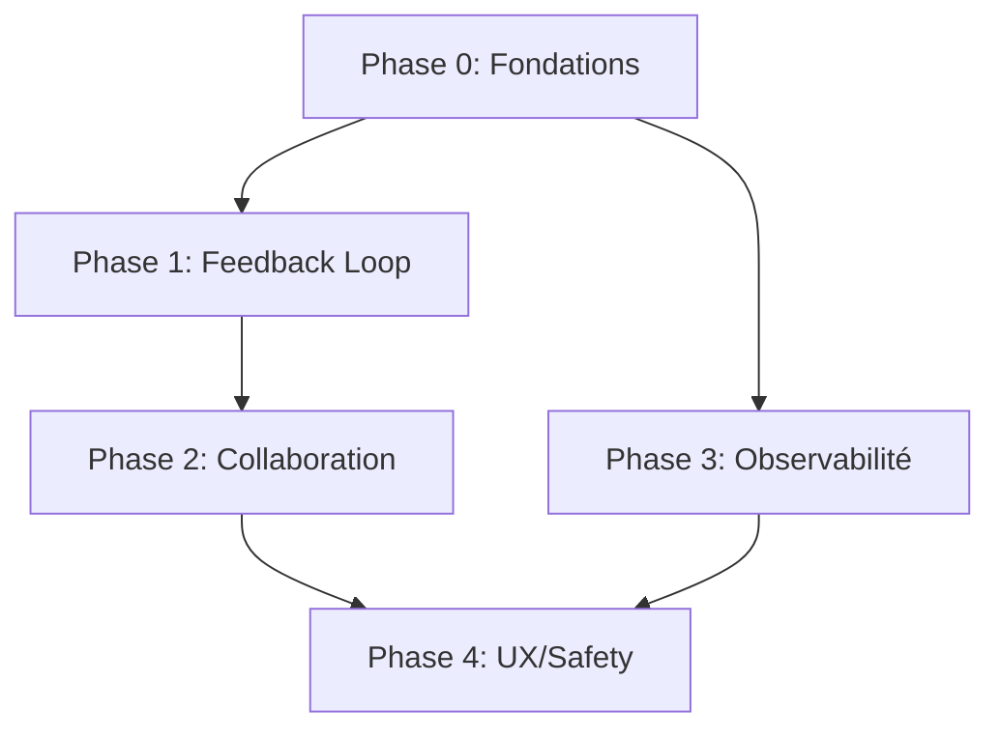

# 📋 Vue d'Ensemble - Toutes les Phases

Ce document donne un aperçu rapide de chaque phase. Pour les détails techniques, voir `PHASE-X-XXX.md` correspondant.

---

## Phase 1: Feedback Loop Inter-Agents (5-7 jours)

### Objectif
Permettre aux agents d'apprendre des recommandations des autres agents et mesurer leur impact.

### Critères Implémentés
1. **Feedback Loop Basique** - Traçabilité des recommandations appliquées
2. **Impact Measurement** - Mesure ROI des recommandations après 7 jours
3. **Learning Insights** - Détection patterns gagnants

### Livrables Clés
- Table `recommendation_tracking`
- Extension `memory_contribution.applied_recommendations`
- Workflow hebdomadaire Sora (mesure impact)
- Dashboard "Top Recommendations"

### Exemple Concret
```
Luna recommande: "Utilise ton expert pour copy"
Milo génère copy avec ton expert → Signale application
Sora (après 7j): "Ton expert → +12% CTR vs baseline"
PM écrit insight: "Pattern gagnant: ton expert"
Prochaine fois: Milo voit insight → Applique automatiquement
```

---

## Phase 2: Collaboration Multi-Agents (10-14 jours)

### Objectif
Orchestration intelligente de workflows complexes impliquant plusieurs agents.

### Critères Implémentés
1. **Conflict Resolution** - Détection contradictions entre agents
2. **Multi-Agent Orchestration** - Workflows prédéfinis (ex: launch_meta_campaign)
3. **Peer Review** - Validation inter-agents avant livraison

### Livrables Clés
- Table `agent_conflicts`
- Table `workflow_orchestrations`
- 3+ workflows prédéfinis (campagne Meta, audit SEO, competitive intel)
- System peer review (validation_requests)

### Workflows Prédéfinis
```
launch_meta_campaign (6 étapes):
  1. Luna → Valide stratégie (BLOQUANT)
  2. Milo → Génère 3 visuels + 5 copies (PARALLÈLE)
  3. Luna → Peer review visuels (BLOQUANT)
  4. Sora → Vérifie tracking pixel (BLOQUANT)
  5. Marcus → Lance campagne
  6. Sora → Monitoring J+1, J+3, J+7
```

---

## Phase 3: Observabilité & Résilience (7-10 jours)

### Objectif
UX professionnelle avec feedback en temps réel et gestion robuste des erreurs.

### Critères Implémentés
1. **Real-Time Progress Tracking** - Progress bars détaillées pour long-running tasks
2. **Error Recovery** - Retry automatique avec backoff exponentiel
3. **Async Task Queue** - Background jobs pour tâches >10 min

### Livrables Clés
- Table `agent_task_progress` + Realtime subscriptions
- Retry logic + circuit breaker
- Table `background_jobs` + worker Edge Functions
- UI: ProgressBar component avec étapes

### Exemple Concret
```
Luna: "Audit SEO 50 concurrents"
UI affiche: "Étape 23/50: Analyzing competitor X (46%)"
Meta API rate limit → Auto-retry après 60s
Audit >10 min → Background job + notification fin
```

---

## Phase 4: UX & Safety Avancés (5-7 jours)

### Objectif
Safety net pour utilisateur + optimisations performance.

### Critères Implémentés
1. **Undo/Rollback** - Annuler actions critiques
2. **Caching Layer** - Cache intelligent (5 min analytics, 24h competitive intel)
3. **Performance Optimizations** - Indexes, pagination, query optimizations

### Livrables Clés
- Table `action_history` + rollback functions
- Table `cache_entries` + strategies par type
- Query optimizations (indexes Supabase)
- UI: Bouton "Undo" pour actions critiques

### Exemple Concret
```
Marcus lance campagne €1000/jour
User: "Oh non, je voulais €100!"
User clique "Undo" → Campagne pausée sur Meta
Action_history restored → State reverted
```

---

## 🎯 Dépendances entre Phases



**Critical Path:**
Phase 0 → Phase 1 → Phase 2 → Phase 4
(Phase 3 peut commencer après Phase 0)

---

## 📊 Métriques de Succès Globales

### Techniques
- 100% recommandations trackées
- ≥80% recommandations avec impact mesuré
- 0 conflits non-détectés
- ≥95% API calls réussissent (avec retry)
- <1s latence dashboard (cache)

### Business
- 0 incidents financiers
- -50% support tickets
- +30% taux complétion tâches complexes
- +40% satisfaction utilisateur (NPS >50)
- Capacité 100+ users simultanés

### Alignment PRD
- ✅ PRD 1.3 "Agents s'adaptent automatiquement"
- ✅ PRD 2.4 "Collaboration via mémoire collective"
- ✅ PRD 4.F "Memory Read/Inject enrichi"
- ✅ PRD 7.4 "Sécurité multi-tenant ready"

---

## 🚀 Timeline Global

```
Semaine 1: Phase 0 (Fondations)
Semaine 2: Phase 1 (Feedback Loop)
Semaines 3-4: Phase 2 (Collaboration)
Semaines 5-6: Phase 3 (Observabilité)
Semaine 7: Phase 4 (UX/Safety)

Total: 7 semaines (env. 2 mois)
```

---

## 📚 Documentation Détaillée

Pour chaque phase, voir:
- `PHASE-0-FONDATIONS.md` - ✅ Disponible
- `PHASE-1-FEEDBACK-LOOP.md` - 🔜 À créer lors Phase 1
- `PHASE-2-COLLABORATION.md` - 🔜 À créer lors Phase 2
- `PHASE-3-OBSERVABILITE.md` - 🔜 À créer lors Phase 3
- `PHASE-4-UX-SAFETY.md` - 🔜 À créer lors Phase 4

---

**Status:** 🟢 Roadmap validée
**Current Focus:** Phase 0 - State Flags Enforcement
**Next Milestone:** Fin Phase 0 (J+7)
